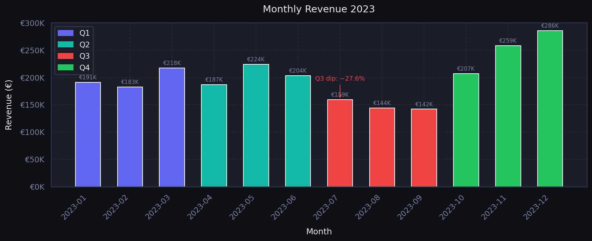
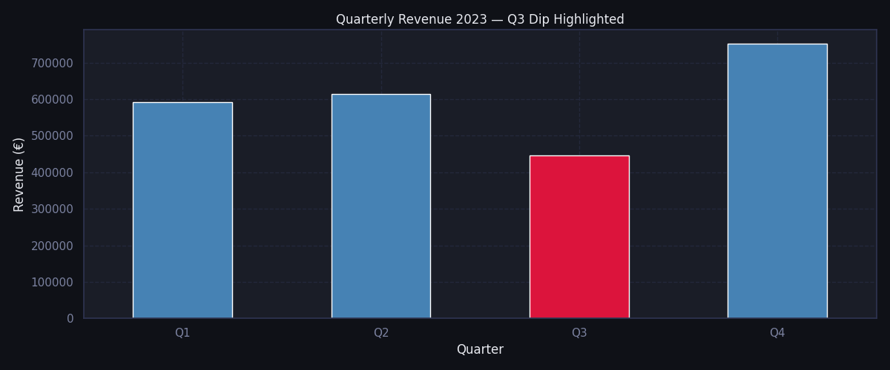
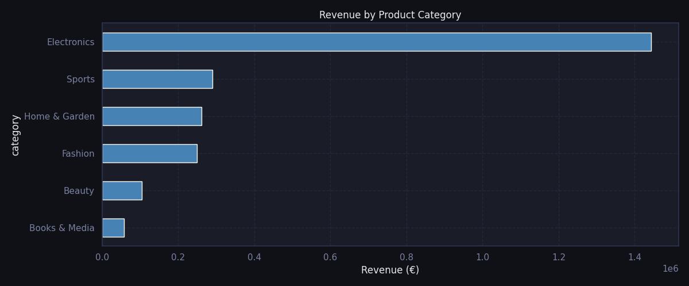
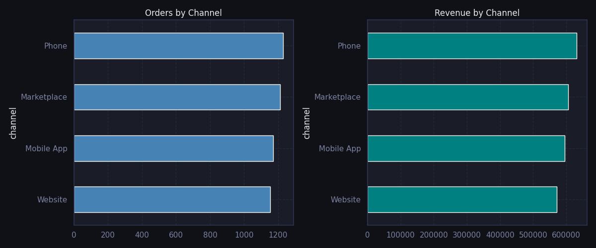
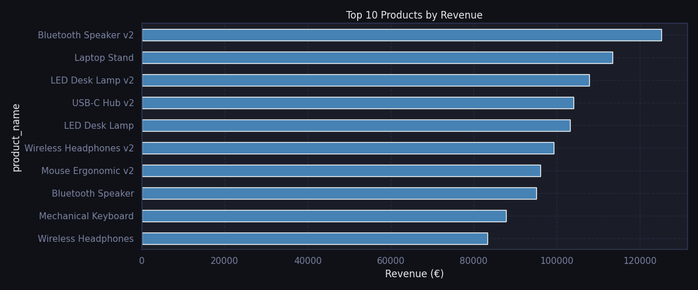
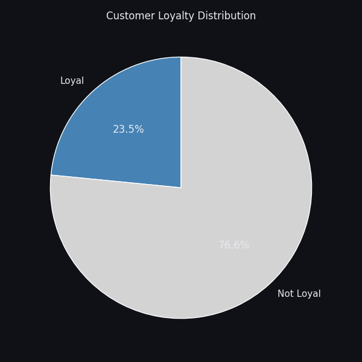
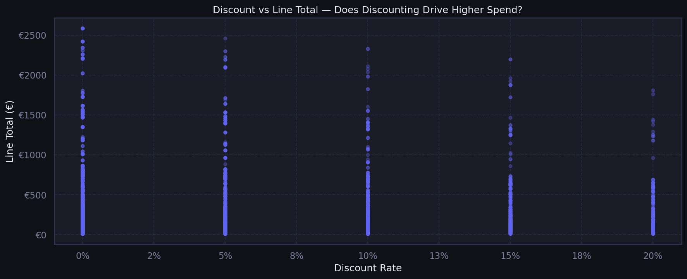

# E-Commerce Performance Analysis 2023
### Business Analyst Portfolio Project | Nasim Maleki

[](https://python.org)
[]()
[]()

---

## Business Context

A European e-commerce company experienced a significant revenue decline in Q3 2023.
As Business Analyst, I was tasked with identifying the root cause, understanding which
customer segments and product categories were most affected, and delivering
evidence-based recommendations.

---

## Business Questions

- Where exactly does the revenue dip occur and how severe is it?
- Is the drop caused by fewer orders, or lower spend per order?
- Which product categories and channels are most affected?
- How loyal is the customer base — and what does loyalty mean in this data?
- Does discounting actually drive higher spend?
- Who are the most valuable customers?

---

## Project Structure

```
ecommerce-kpi-analysis/
│
├── README.md
│
├── data/
│   ├── orders.csv               # 5,260 orders across 2023
│   ├── order_items.csv          # 10,414 line items
│   ├── customers.csv            # 2,000 customers
│   └── products.csv             # 120 products across 6 categories
│
└── analysis/
    ├── eda_and_kpis.py          # EDA, KPI definitions, visualizations
    ├── chart_monthly_revenue.png
    ├── chart_quarterly_revenue.png
    ├── chart_category_revenue.png
    ├── chart_channel_performance.png
    ├── chart_top_products.png
    ├── chart_loyalty.png
    └── chart_discount_correlation.png
```

---

## Key Findings

| # | Finding | Business Implication |
|---|---------|----------------------|
| 1 | Q3 revenue dropped −27.6% vs Q2 | Seasonal demand issue, not a pricing problem |
| 2 | Average order value stayed stable at €505 across all quarters | Customers who did buy, spent normally — volume dropped, not spend |
| 3 | Only 23.4% of customers qualify as loyal (2+ orders, 6+ month lifecycle) | 76% of the customer base needs re-engagement |
| 4 | Electronics generates 60% of total revenue | High concentration risk — one category drives the business |
| 5 | Discounting shows no correlation with higher spend per order | Blanket discounts reduce margin without increasing order value |
| 6 | All four channels perform within a close range | No single channel dominates — diversified but no clear winner |

---

## KPIs Defined

- **Total Revenue** — completed orders only
- **Average Order Value (AOV)** — revenue per completed order
- **Return Rate** — returned orders as % of all orders
- **Quarterly & Monthly Revenue** — trend analysis
- **Quarter-over-Quarter Growth** — % change between quarters
- **Customer Loyalty Rate** — customers with more than average orders AND 6+ month lifecycle
- **Channel Performance** — orders and revenue by acquisition channel
- **Category Revenue & Order Volume** — by product category
- **Top 10 Products** — by total revenue generated
- **Top 10 Customers** — by lifetime spend

---

## Visualizations















---

## Recommendations

1. **Launch a pre-Q3 campaign** — start targeted promotions in June to prevent the summer demand drop
2. **Introduce a VIP retention programme** — 33% of revenue comes from a small customer group; early access offers and personalised outreach would reduce churn risk
3. **Replace blanket discounts with segment-targeted offers** — data shows discounts do not increase order value; redirect discount budget to churned customer reactivation
4. **Diversify beyond Electronics** — 60% revenue dependence on one category is a structural risk; invest in growing Sports and Home & Garden
5. **Re-engage the 76% non-loyal customers** — automated email sequences triggered at 60 and 90 days post-purchase could significantly improve retention rate

---

## Tools Used

| Tool | Purpose |
|------|---------|
| Python — Pandas | Data loading, cleaning, KPI calculation |
| Python — Matplotlib, Seaborn | Data visualizations |
| SQL — SQLite, DBeaver | 10 business queries, CTE, multi-table joins |

---

## How to Run

```bash
# 1. Clone the repository
git clone https://github.com/nasimmaaleki/ecommerce-kpi-analysis.git

# 2. Install dependencies
pip install pandas numpy matplotlib seaborn

# 3. Run the analysis
python analysis/eda_and_kpis.py
```

---

*Nasim Maleki · Business Analyst · Bremen, Germany*
*[LinkedIn](https://linkedin.com/in/nasim-maaleki) · nasimmaleki.official@gmail.com*
